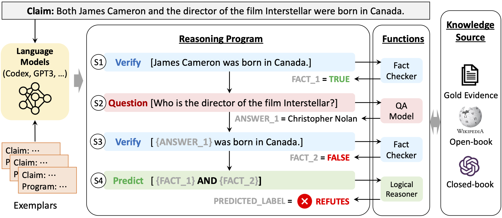

# ProgramFC
Codes for ACL 2023 Paper ["Fact-Checking Complex Claims with Program-Guided Reasoning"](https://arxiv.org/abs/2305.12744)

## Introduction

We present Program-Guided Fact-Checking (ProgramFC), a novel fact-checking model that decomposes complex claims into simpler sub-tasks that can be solved using a shared library of specialized functions. We first leverage the in-context learning ability of large language models to generate reasoning programs to guide the verification process. Afterward, we execute the program by delegating each sub-task to the corresponding sub-task handler. This process makes our model both explanatory and data-efficient, providing clear explanations of its reasoning process and requiring minimal training data. We evaluate ProgramFC on two challenging fact-checking datasets and show that it outperforms seven fact-checking baselines across different settings of evidence availability, with explicit output programs that benefit human debugging. 



**Note: The results reported in our paper are mostly based on Codex. However, in light of OpenAI's decision to discontinue support for the Codex API from March 23rd, 2023, we have transitioned to using GPT-3.5 (`text-davinci-003`) for the code implementation provided here.**

First, install all the required packages:

```bash
pip install -r requirements.txt
```

## Program Generation

Releasing soon...

## Program Execution

Releaseing soon...

## Reference
Please cite the paper in the following format if you use this dataset during your research.

```
@article{pan2023factchecking,
    title = {Fact-Checking Complex Claims with Program-Guided Reasoning},
    author = {Liangming Pan and Xiaobao Wu and Xinyuan Lu and Anh Tuan Luu and William Yang Wang and Min-Yen Kan and Preslav Nakov},
    booktitle = {Proceedings of the 61th Annual Meeting of the Association for Computational Linguistics (ACL)},
    url = {https://arxiv.org/abs/2305.12744},
    year = {2023}
}
```

## Q&A
If you encounter any problem, please either directly contact the [Liangming Pan](liangmingpan@ucsb.edu) or leave an issue in the github repo.
